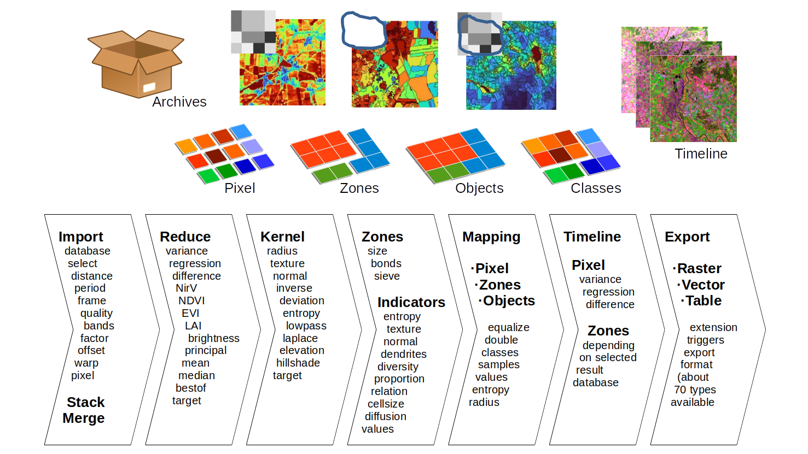
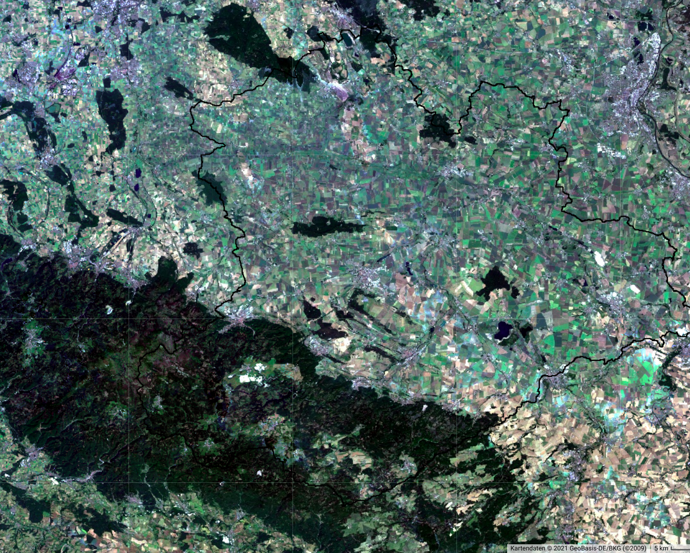
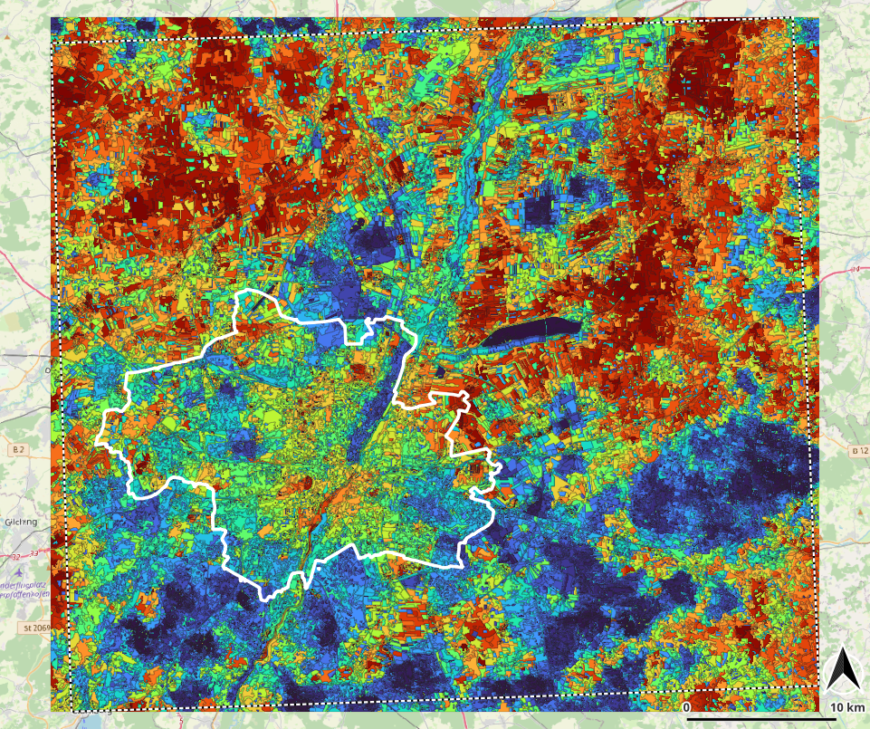
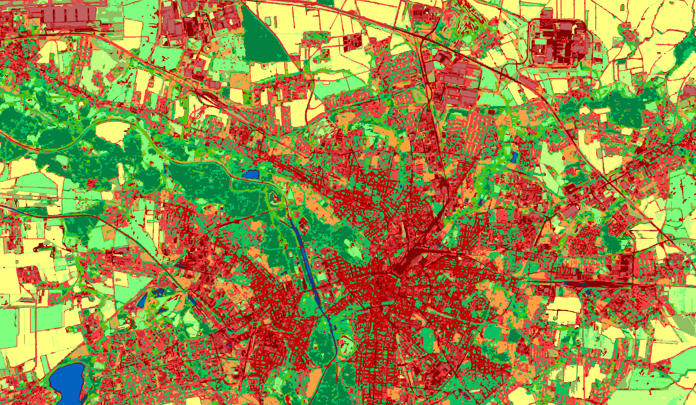
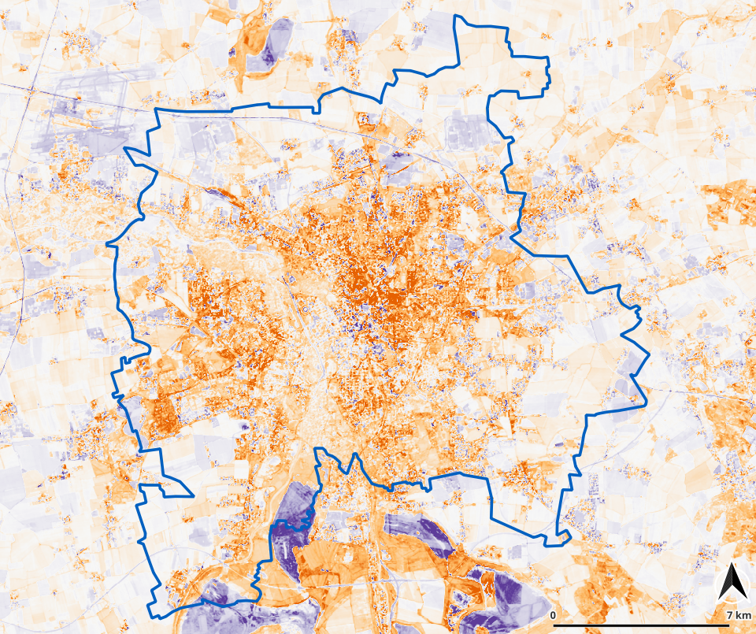

# ESIS: EcoSystem Integrity Service

**Peter Selsam, Angela Lausch, Jan Bumberger**

Department Monitoring and Exploration Technologies
Helmholtz Centre for Environmental Research GmbH – UFZ
Permoserstraße 15, 04318 Leipzig, Germany

peter.selsam@ufz.de, www.ufz.de

------

# ESIS

The Ecosystem Integrity Service (ESIS) was designed to link, analyze and model data from the natural environment. Currently, land-use borders, landscape diversity, development and the main types of landcover are the main objectives.

ESIS data are based on observations, measurements and derived data, which are referred to below as “traits”. ESIS tools offer processes to create, combine and analyze traits.

*Vegetation index of Central Europe superimposed with shading from an elevation model. Elevation data from SRTM mission (2001), image data Landsat-8, 2014-2020. Vegetation index NIRv (red and infrared). Values between 0.0 (turquoise), 0.1 (red brown) to 0.4 (dark green)* 

### Traits	

Concerning ESIS, “traits” are well-defined properties associated with a specific place and time. Traits do not need to be interpreted or calibrated, they are directly usable (FAIR²). Traits should be scale-invariant, sensor-independent and globally applicable. Each location can be described by numerous traits.

Traits can represent an observation or mapping, a measurement by a stationary device, by remote sensing or even a classification according to a defined method. Technically traits can be formatted as points (observations), lines (time series), grids (maps) or multidimensional matrices.

Traits are always accompanied by metadata describing data formats and data collection. In addition to a formal description (ISO), there is room for help and publications. 

Traits can be supplemented and expanded at any time without destabilizing the system. The interface is open and documented. Users can integrate their own traits and tools into the system

### Tools	

The software library [Imalys](https://github.com/c7sepe2/Imalys_ESIS-Software-Tools) (image analysis) was developed to derive traits from satellite images. Imalys offers generic processes for specific tasks, wrappers for known processes and a workflow that can be automated. 

Traits and tools are organized according to the modular principle. Both can be supplemented or improved if desired. The interfaces are open and documented.

### Further reading

[1] Lausch A, Selsam P, PauseM, Bumberger J. 2024: Monitoring vegetation-and geodiversity with remote sensing and traits.Phil.Trans.R.Soc.A382: 20230058. https://doi.org/10.1098/rsta.2023.0058

[2] Selsam P., Bumberger J., Wellmann T., Pause M., Gey R., Borg E., Lausch A.: Ecosystem Integrity Remote Sensing – Modelling and Service Tool - ESIS/Imalys,

[3] SoftwareX: Selsam P., Lausch A., Bumberger J., Wellmann T.: Imalys – ESIS software library to extract landscape characteristics from remote sensing data

------

# Imalys: ESIS software library

Remote sensing has become an important tool for environmental research and especially for landscape analysis. In addition, the spatial distribution and development of remotely sensed parameters can effectively complement and extend traditional medical, biological, ecological and geographical tasks. 

However, data acquisition, data analysis and selection of suitable methods are still time-consuming for experts from other disciplines. In the ESIS project ([Lausch A, Selsam P, Pause M, Bumberger J.](https://doi.org/10.1098/rsta.2023.0058)) we are trying to put environmental indicators on a well-defined and reproducible basis. The Imalys software library is supposed to generate the remote sensing products defined for ESIS. Imalys is designed to run on a server like the OpenGeo Server (https://geoserver.org/) but can be used on any PC. 

Imalys was developed to select and process remote sensing data as automatically as possible. Imalys is particularly suitable when large amounts of data need to be processed identically and comparably.

### Image selection

Imalys independently selects suitable archives for a specified area and time period, extracts and calibrates the raw data for reflectance or radiation and projects them for a freely selected system. Imalys evaluates the quality of the raw data and produces optimized results using short time series. Data from different archives are automatically merged so that the user can further process an optimized image of the selected area.

*RGB color composite (natural colors) from Landsat-8 pictures. Mountainous region of the Harz and catchment of the Bode river (black lines), Germany, summer 2020*

### Pixel analysis

For image processing, Imalys offers processes for various pixel indices such as the vegetation index NDVI as well as processes for pattern analysis such as textures, contrast enhancement or Rao's entropy. Imalys supports time series, can determine trends and variances and contains methods for reducing image dimensions such as eigenvalues.

*Time course of the vegetation index NIRv between 2010 and 2020 (yellow) compared with the extreme dry year 2018 (green). Based on MODIS-Terra weekly images of green areas in the city of Leipzig.*

### Objects and indicators

Imalys uses a generic process for the spatial delineation of largely homogeneous areas that we call "zones". Zones can be attributed with various indicators for their spectral properties, the size, shape and the linkage of the zones. As the mean size of the zones can be selected freely, most of the indicators are largely independent of the absolute size and characterize areas on a larger scale than pixels.

*Rao’s Entropy is calculated as the mean differences of all pixel combinations within a sample. In this case zones are used as samples to return appropriate values even for small image elements. Colors: blue (0.0) … red (0.12), Landsat 8/9, May…October 2022, vicinity of Munich (white frame)*

### Machine learning

The spectral combination of pixels and the color, shape, size and linkage of the zones can be classified using self-learning algorithms. Imalys also provides a process that combines different zones into structured "objects". The structure of these objects allows classification based on the internal composition of the objects and makes links such as cast shadows next to buildings or characteristic mixtures of different tree crowns accessible for classification. Spectrally identical areas can be assigned to completely different classes.

*Object based classification without any training using self adjusting machine learning processes. Spectral and structural clustering to 30 object types reduced to 15 landuse types. User defined colors. Leipzig 2017*

### Process control

Many of the processes implemented in Imalys are also available with other software but Imalys bundles known and new processes in one command and can process large amounts of data without manual interaction. Imalys uses simple lists of commands and parameters to define process chains. With an optional variable list, the process chain can be repeated as often as required with alternating inputs. 

*Regression is used to estimate dependencies between different parameters. In this case the NirV plant metabolism index shows an increase (orange) or decrease (blue) up to 0.2% a year. Images taken from May…July, 1984…2022, Sensor Landsat 4, 5, 8, 9.*
